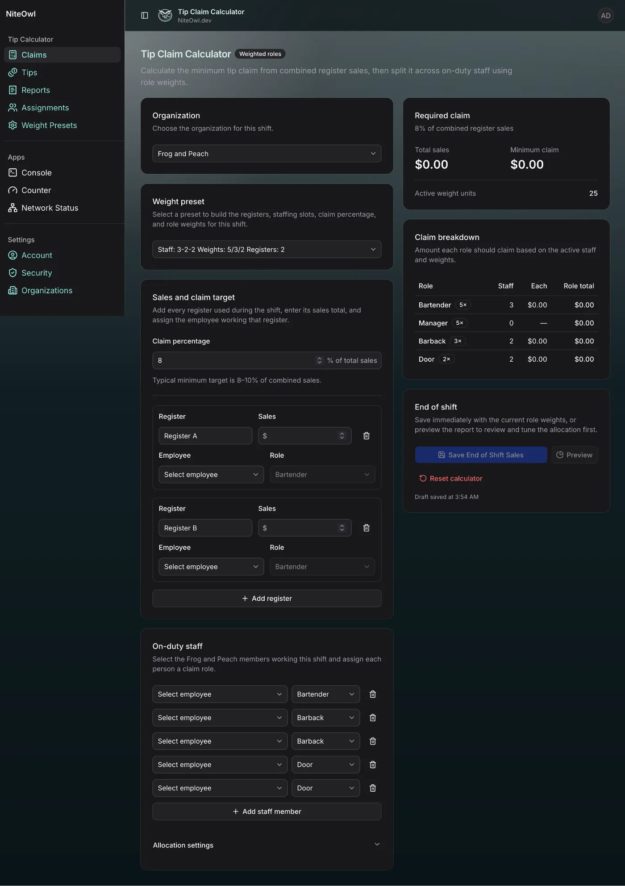

# Tip Claim Calculator

> **New here?** Read [Getting Started](getting-started.md) first.

The **Claims** page calculates the minimum tip claim from combined register sales, then distributes that claim across the employees working the shift using role weights.

The page supports two ways to configure a shift:

- **One-off configuration** — build the shift directly on the Claims page by choosing the register count, claim percentage, on-duty staffing, roles, and weights you need for that shift.
- **Weight Preset** — load a saved staffing configuration so the form is built automatically, then fill in the employees and register sales for the current shift.

Weight Presets are optional. A preset saves time when the same staffing pattern is used repeatedly, but the calculator does not require one.

See [Weight Presets](weight-presets.md) for a detailed explanation of role weights and why weights are preferable to fixed role percentages.

## Starting from the blank Claims page

The default Claims page starts with the selected organization, no Weight Preset, the default claim percentage, one register row, and no on-duty staff assigned.


From this state you can create a one-time shift configuration directly on the page.

To build a one-off configuration:

1. Select the organization for the shift.
2. Leave **Weight preset** unselected.
3. Set the **Claim percentage** required for the shift.
4. Add or remove register rows as needed.
5. Add each employee working the shift under **On-duty staff** and choose that employee's role.
6. Open **Allocation settings** if the default role weights need to be changed for this shift.
7. Enter the sales for each register and assign the employee responsible for that register.

The configuration applies only to the current working shift. If the same setup will be reused, create a Weight Preset instead of rebuilding it each time.

## Loading a Weight Preset

Selecting a Weight Preset automatically builds the Claims form from the saved staffing state.

For Claims, a preset can populate:

- register count;
- claim percentage;
- Manager staff count and weight;
- Bartender staff count and weight;
- Barback staff count and weight;
- Door staff count and weight.

For example, a preset named `Staff: 3-2-2 Weights: 5/3/2 Registers: 2` creates two register rows and seven staffing slots: three Bartenders, two Barbacks, and two Door employees using 5/3/2 role weights.



The preset creates the structure of the shift, not the employee assignments. Employee selectors remain blank so the manager can choose the people who actually worked that shift.

You can still adjust the working configuration after loading a preset. Changing a value on the current shift does not rewrite the saved preset unless you edit the preset itself on the Weight Presets page.

## Entering register sales

Enter the sales total for every register used during the shift. The **Required claim** card updates automatically from the combined sales and the current claim percentage.


For example, with:

```text
Register A: $4,420
Register B: $3,000
Combined sales: $7,420
Claim percentage: 8%
```

the minimum claim is:

```text
$7,420 × 8% = $593.60
```

The calculator then applies the active staff weights to the $593.60 claim.

With three Bartenders at weight 5, two Barbacks at weight 3, and two Door employees at weight 2, there are 25 active weight units:

```text
3 × 5 + 2 × 3 + 2 × 2 = 25
```

The Claim breakdown therefore shows approximately:

| Role | Staff | Weight each | Claim each | Role total |
| --- | ---: | ---: | ---: | ---: |
| Bartender | 3 | 5 | $118.72 | $356.16 |
| Barback | 2 | 3 | $71.23 | $142.46 |
| Door | 2 | 2 | $47.49 | $94.98 |
| **Total** | **7** | | | **$593.60** |

The application allocates money in cents and reconciles rounding so the final employee allocations exactly equal the required claim.

## Assigning employees

A loaded preset creates blank staffing slots for the configured roles. Select the actual employee in each slot.

The employee list is controlled by the organization's **Assignments** page. A staffing slot only offers employees who are enabled for that role. For example, a Barback slot only lists organization members who have Barback eligibility.

Register rows also contain an employee selector so the person responsible for each register can be recorded separately from the complete on-duty staff list.

## One-off shift versus preset

Use a **one-off configuration** when the staffing mix is unusual or unlikely to be reused. Configure the page directly and complete the shift normally.

Use a **Weight Preset** when a staffing pattern occurs regularly. The preset becomes a reusable starting point and prevents the user from repeatedly rebuilding register rows, staffing slots, the claim percentage, and role weights.

A useful way to think about the difference is:

```text
Preset = reusable shift template
Claims page = this specific shift
```

Loading a preset does not lock the shift. It simply provides the starting configuration.

## Required claim and Claim breakdown

The right side of the page summarizes the current calculation.

**Required claim** shows:

- combined register sales;
- current claim percentage;
- minimum claim amount;
- total active weight units.

**Claim breakdown** shows each role's active staff count, per-person allocation, and role total.

These values update as register sales, staffing, roles, or weights change.

## End of shift

When the shift is complete, the **End of shift** section can save the report immediately or open **Preview** first to review the complete report and employee allocation.

Saved reports appear on the **Reports** page and can be corrected later when the user has permission.

Claims also preserve an in-progress draft locally for the selected organization. Refreshing the page does not immediately discard the shift. **Reset calculator** clears the working draft and restores the page to its starting state.
