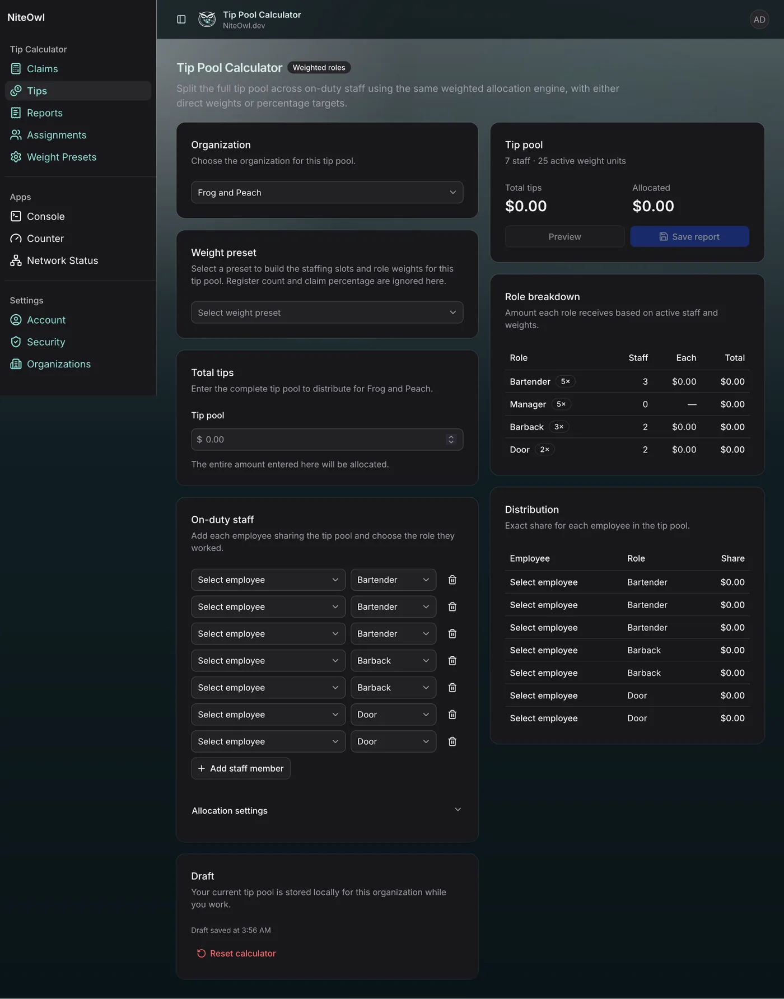
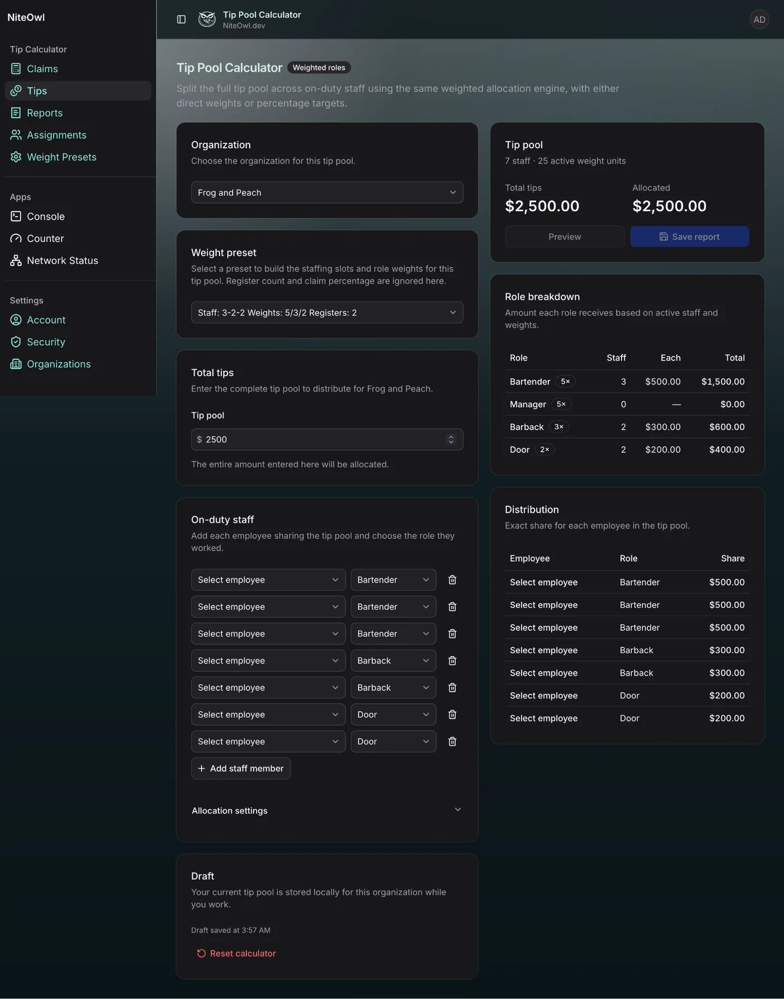

# Tip Pool Calculator

> **New here?** Read [Getting Started](getting-started.md) first.

The **Tips** page distributes one complete tip pool across the employees working the shift using the same weighted allocation engine as Claims.

Unlike Claims, the Tip Pool Calculator does not use register sales or a claim percentage. You enter the complete amount that needs to be distributed, then the calculator allocates that amount across the active employees according to their role weights.

The page supports two ways to configure a shift:

- **One-off configuration** — build the current staffing mix directly on the Tips page and adjust the active role weights as needed.
- **Weight Preset** — load a reusable staffing configuration so the staffing slots and role weights are created automatically.

Weight Presets are optional. They are useful for recurring staffing patterns, but a tip pool can always be configured directly on the page.

See [Weight Presets](weight-presets.md) for a detailed explanation of how weighted allocation works.

## Starting from the Tip Pool page

The Tips page begins with the selected organization, a Tip pool amount of $0.00, and the current working staffing configuration.

If no preset is selected, the configuration can be treated as a one-off shift. Add or remove employees, choose each role, and adjust role weights under **Allocation settings** if needed.



To create a one-off tip pool configuration:

1. Select the organization.
2. Leave **Weight preset** unselected.
3. Add each employee who is sharing the pool.
4. Choose the role each employee worked.
5. Adjust role weights under **Allocation settings** if the default relationship is not appropriate for this shift.
6. Enter the complete **Tip pool** amount.
7. Review the Role breakdown and Distribution tables before saving.

The current configuration does not have to be saved as a preset. If the staffing pattern will be used repeatedly, create a Weight Preset so it can be loaded later with one selection.

## Loading a Weight Preset

Selecting a Weight Preset automatically builds the working staffing state and applies its role weights.

For example, loading a preset named `Staff: 3-2-2 Weights: 5/3/2 Registers: 2` creates seven staffing slots:

- three Bartenders at weight 5;
- two Barbacks at weight 3;
- two Door employees at weight 2.


The preset may also contain a register count and claim percentage because presets are shared with Claims. **Tips intentionally ignores those two Claims-specific fields.** Only staffing counts and role weights are used on the Tip Pool Calculator.

Employee selectors remain blank after loading the preset so the manager can choose the people who actually worked that shift.

The loaded preset is a starting point, not a lock. The working shift can still be changed without altering the saved preset itself.

## Entering the tip pool

Enter the complete amount that needs to be distributed in the **Tip pool** field. The entire amount entered there is allocated.



For example, with a $2,500 pool and the 3-2-2 staffing preset using 5/3/2 weights:

```text
Bartenders: 3 × 5 = 15 units
Barbacks:   2 × 3 =  6 units
Door:       2 × 2 =  4 units
                         --
Total:                  25 units
```

Each active weight unit is therefore worth:

```text
$2,500 ÷ 25 = $100
```

The result is:

| Role | Staff | Weight each | Share each | Role total |
| --- | ---: | ---: | ---: | ---: |
| Bartender | 3 | 5 | $500 | $1,500 |
| Barback | 2 | 3 | $300 | $600 |
| Door | 2 | 2 | $200 | $400 |
| **Total** | **7** | | | **$2,500** |

The **Tip pool** summary shows the total amount and the amount allocated. The **Role breakdown** shows the result by role, while **Distribution** shows the exact share assigned to every employee slot.

## Assigning employees

The preset or one-off configuration creates the staffing slots, but the actual employee must still be selected for each slot.

Employee options are controlled by the organization's **Assignments** settings. A Bartender slot only lists employees enabled as Bartenders, a Barback slot only lists eligible Barbacks, and so on.

This separates two ideas:

```text
staffing configuration = how many people and what roles
employee assignment    = who actually worked those roles
```

That allows the same preset to be reused across many shifts even when different employees are working.

## One-off shift versus preset

Use a **one-off configuration** when the staffing mix is unusual or the weight relationship only applies to the current shift. Build the working staff list directly on the Tips page and adjust the weights as needed.

Use a **Weight Preset** when the staffing mix occurs regularly. Loading a preset saves the user from repeatedly recreating the staffing slots and role weights.

A preset does not contain the actual tip amount. The pool amount always belongs to the current shift and is entered on the Tips page.

A useful way to think about the workflow is:

```text
Preset = reusable staffing and weight template
Tips page = this specific pool and these specific employees
```

## Why Tips ignores register count and claim percentage

Weight Presets are shared between Claims and Tips so one recurring staffing state can be reused by both calculators.

Claims needs register count and claim percentage because it calculates a required claim from sales. Tips already starts with the final amount to distribute, so those fields are irrelevant.

When the same preset is loaded:

| Preset field | Claims | Tips |
| --- | :---: | :---: |
| Staffing counts | Used | Used |
| Role weights | Used | Used |
| Register count | Used | Ignored |
| Claim percentage | Used | Ignored |

This lets one `3-2-2 / 5-3-2` preset describe the staffing state for both workflows without forcing the Tip Pool Calculator to know anything about registers or sales percentages.

## Reviewing and saving

As the tip amount, staffing, roles, or weights change, the summary and distribution tables update immediately.

Before saving, verify that:

- the complete pool amount is correct;
- every employee sharing the pool is present;
- each employee has the correct role;
- the role weights reflect the intended employee-to-employee relationship;
- the **Allocated** total matches the total tips.

Use **Preview** to review the completed report, then **Save report** to store it. Saved Tip Pool reports appear on the **Reports** page and can be corrected later when authorized.

The Tips page also keeps an in-progress draft locally for the selected organization. **Reset calculator** clears that working draft and restores the calculator state.
